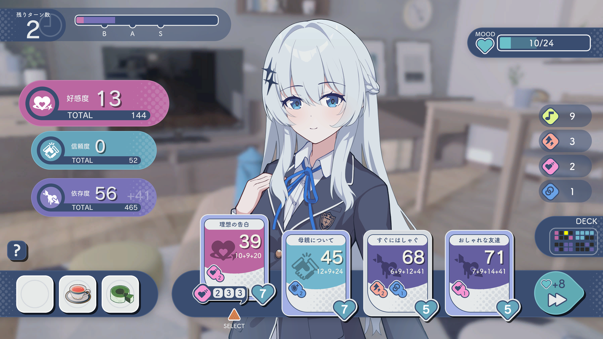

# 0.このドキュメントについて
本ドキュメントは、2025年5月11日にunityroomで公開したフリーゲーム`キミトーク`について、**ディレクター,エンジニア,シナリオライター**の`Tomy_Y`がまとめたドキュメントです。

# 1.キミトークについて
## 基本情報
 - ジャンル：恋愛カードゲーム
 - 使用技術：Unity, C#
 - リリース：2025年5月11日
 - 開発期間：約10カ月
 - 閲覧数：16000(2025年6月6日時点)
## 説明
キミトークは、幼馴染でクラスメイトの女の子と、会話カードで関係性を深める恋愛カードゲームです。関係性によってシナリオが分岐します。
休日はデートに誘ったりすることができます。
また、ヒロインに自分好みの服装にしてきてもらうことができます。

# 2.開発体制
## チームメンバー
ディレクター, エンジニア, シナリオライター：Tomy_Y(著者)
プロデューサー, デザイナー：1名
サウンドクリエイター：1名
シナリオ補佐：1名
## 開発ツール
エンジン：Unity、C#
ゲームサーバー：Firebase Realtime Database
バージョン管理システム：Git/GitHub
シナリオデータ管理：Excel
表情データ管理：Google スプレッドシート
コミュニケーションツール：Discord
タスク管理：Trello
シナリオ考案：Miro
ファイル共有：Google Drive
アンケート：Google フォーム

# 3.担当箇所
## Tomy_Y(著者)の担当箇所
### ディレクター：
 - ゲームデザイン、ゲームシステムの制定
 - ゲームバランスの調整
 - チーム結成及び運用
 - プロジェクトマネジメント
### エンジニア：
 - Unity, C#によるゲームロジックの作成
 - バージョン管理システム(Git/GitHub)の環境構築及びチーム運用の制定
 - プロジェクトに応じた技術選定
 - オブジェクト指向によるクラス設計及び実装
 - OSS導入
### シナリオライター
 - シナリオの作成
 - キャラクター及び世界観の策定
 - 表情コード含めたシナリオのゲーム内への打ち込み
### その他
 - SNS運用
 - ユーザーデータ、アンケート分析

# 4.システム設計と実装技術

# 5.ユーザーデータ分析

# 6.プレスリリース

# 7.SNS運用

# 8.今後の展望

ゲーム内スクショ
